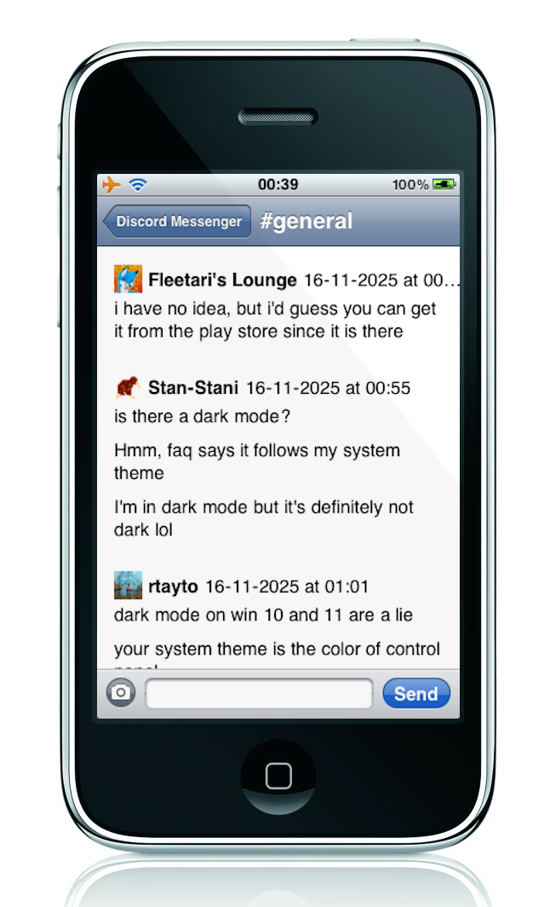

# Purplecord

This is an attempt to create a Discord client for iOS 3 and later.

<p align="center">

</p>

**This project is currently in alpha, meaning you should NOT expect stability or feature-completeness.**

Support for newer versions of iOS is not guaranteed because I do not own any newer devices.

This can log in (which takes about 30 seconds on my iPhone 3G over Wi-Fi), view messages,
and send simple messages. But it is not fully featured yet! And also, it's really slow and
drains your battery fast, so probably not very practical either.

## Name Choice

The name was chosen because the original iPhone was known during development as "Project Purple". Since this
client runs on iOS 3, and iOS 3.1.3 is the last version that will run on the original iPhone, the name "Purplecord"
was chosen.

## Active Issues

Currently the icons still aren't proper. (for some reason iOS 7 uses the prerendered iOS 6 and older version of the app icon)
Need to figure this out.

## Planned Features

Purplecord is currently not a full featured client.  The following features will be implemented in the following rough order:

- Read states
- Opening attachments in full screen
- Downloading attached images
- Markdown formatting support
- Multi-line text input
- Replying to messages
- Editing messages
- Typing indicators
- Member list
- Optimizations and stability fixes
- Merge the [DiscordMessenger](https://github.com/DiscordMessenger/dm) and Purplecord backends into one common backend

## Attributions

Thanks to [Electimon](https://yzu.moe) for helping me out with getting C++11 support on iOS 3!

**NOTE**: Replacing "ios3" with "ios6", "iPhoneOS3.0.sdk" with "iPhoneOS6.0.sdk" and "iOS 3" with "iOS 6" in the
following build guide should work.  However, you must pass `BUILD_FOR_IOS3=no` to this project's makefile to build
for iOS 6 and later (ARMv7).  AArch64 compilation is currently not supported because I don't have a 64-bit iPhone.

The iOS 3 build was tested on iPhone 3G running iPhone OS 3.1.3.
The iOS 6 build was tested on iPhone 4 running iOS 7.0.

The **iOS 3 build** should run on the following Apple devices, but currently untested:
- iPhone (iPhone OS 3.0 to 3.1.3)
- iPhone 3G (iPhone OS 3.0 to 4.2.1) [tested on iPhone OS 3.1.3]
- iPhone 3GS (iPhoneOS 3.0 to iOS 6.1.6)
- iPhone 4 (iOS 4.0 - iOS 6.1.3)

The **iOS 6 build** should run on the following Apple devices, but currently untested:
- iPhone 3GS (iOS 6.0 to 6.1.6)
- iPhone 4 (iOS 4.0 to 7.1.2) [tested on iOS 7.0]
- Any future iPhone running an iOS version lower than iOS 11, because iOS 11 dropped 32-bit app support

## Building

You must have [Theos](https://theos.dev/docs/installation) installed.  You cannot use any of the
SDKs Theos provides, so you must find the iPhoneOS 3.0 SDK to build.

Also, building has only been tested on Linux, but it might work on Mac OS too.

### Install Clang 22

You will need Clang 22 to compile this project.  If Clang 22 is not provided by your distro's package
manager, you can install Clang 22 with the following command:
```bash
wget https://apt.llvm.org/llvm.sh
chmod +x llvm.sh
sudo ./llvm.sh 22
```

### Fixing a Theos quirk

An issue has been filed for this: https://github.com/theos/theos/issues/847

Basically the way this is supposed to work is, C/ObjC/C++ files will use your system Clang-21 for linking, but
linking should be done with the linker from Theos.  A temporary fix in `$THEOS/makefiles/instance/rules.mk`:

```diff
-TARGET_CXX = $(TARGET_CXX)
+#TARGET_CXX = $(TARGET_CXX)
```

### Fetching the iPhoneOS 3.0 SDK

Download this archive:

Then extract its contents to `$THEOS/sdks/iPhoneOS3.0.sdk`.

### Installing libc++

Download the following archive:
[iPhone OS 3 libc++ pack for armv6](https://iprogramincpp.com/purplecord/libcxx/libcxx-hack-ios3.tar.gz) or
[iOS 6 libc++ pack for armv7](https://iprogramincpp.com/purplecord/libcxx/libcxx-hack-ios6.tar.gz).

Extract it to `$THEOS` (your Theos root directory).  It should be picked up by the makefile eventually.

### Building MbedTLS

First, clone the repository.
```
git clone https://github.com/DiscordMessenger/mbedtls
```

Then, build it:
```
mkdir build-ios3 && cd build-ios3
cmake .. \
	-DCMAKE_TOOLCHAIN_FILE=../iphoneos3.cmake \
	-DCMAKE_BUILD_TYPE=Release \
	-DENABLE_TESTING=OFF \
	-DENABLE_PROGRAMS=OFF \
	-DCMAKE_INSTALL_PREFIX=$CD/../install-ios3
make -j$(nproc)
```

Define the environment variable related to this:
```
PURPLECORD_MBEDTLS_PATH=[your mbedtls checkout path]
```

### Building Libcurl

After building MbedTLS you will need to build libcurl too.

Download:
```
curl -LO https://curl.se/download/curl-7.88.1.tar.gz
tar xf curl-7.88.1.tar.gz
cd curl-7.88.1
```

Open `lib/vtls/mbed.tls` and move this line:
```c
  mbedtls_ssl_conf_rng(&backend->config, mbedtls_ctr_drbg_random,
                       &backend->ctr_drbg);
```
to between `mbedtls_ssl_init` and `mbedtls_ssl_setup`.

Copy `iphoneos.cmake` from the mbedtls checkout directory, then configure and make:
```bash
mkdir build-ios3 && cd build-ios3

cmake .. -DCMAKE_TOOLCHAIN_FILE=../iphoneos3.cmake \
  -DCMAKE_BUILD_TYPE=Release \
  -DCMAKE_INSTALL_PREFIX=$CD/../install-ios3 \
  -DCURL_USE_MBEDTLS=ON \
  -DBUILD_SHARED_LIBS=OFF \
  -DBUILD_CURL_EXE=OFF \
  -DCURL_STATICLIB=ON \
  -DMBEDTLS_INCLUDE_DIRS=$PURPLECORD_MBEDTLS_PATH/include \
  -DMBEDTLS_LIBRARY=$PURPLECORD_MBEDTLS_PATH/build-ios3/library/libmbedtls.a \
  -DMBEDX509_LIBRARY=$PURPLECORD_MBEDTLS_PATH/build-ios3/library/libmbedx509.a \
  -DMBEDCRYPTO_LIBRARY=$PURPLECORD_MBEDTLS_PATH/build-ios3/library/libmbedcrypto.a \
  -DCURL_DISABLE_FTP=ON \
  -DCURL_DISABLE_FILE=ON \
  -DCURL_DISABLE_LDAP=ON \
  -DCURL_DISABLE_LDAPS=ON \
  -DCURL_DISABLE_RTSP=ON \
  -DCURL_DISABLE_DICT=ON \
  -DCURL_DISABLE_TELNET=ON \
  -DCURL_DISABLE_TFTP=ON \
  -DCURL_DISABLE_POP3=ON \
  -DCURL_DISABLE_IMAP=ON \
  -DCURL_DISABLE_SMTP=ON \
  -DCURL_DISABLE_GOPHER=ON \
  -DCURL_DISABLE_MQTT=ON \
  -DCURL_DISABLE_SMB=ON \
  -DCURL_DISABLE_NTLM=ON \
  -DENABLE_WEBSOCKETS=ON

make -j$(nproc)
```

NOTE: If you get an error that says `SystemFramework was not found`, edit CMakeLists.txt and remove the dependency on SystemFramework as we don't have it.

Define the environment variables:
```
PURPLECORD_LIBCURL_PATH=[your curl checkout path]
```

### Building Libwebp

TODO: More Tutorial

```
mkdir build-ios3 && cd build-ios3

cmake .. -DCMAKE_TOOLCHAIN_FILE=../iphoneos3.cmake \
	-DWEBP_ENABLE_SIMD=OFF \
	-DWEBP_BUILD_CWEBP=OFF \
	-DWEBP_BUILD_DWEBP=OFF \
	-DWEBP_BUILD_GIF2WEBP=OFF \
	-DWEBP_BUILD_IMG2WEBP=OFF \
	-DWEBP_BUILD_VWEBP=OFF \
	-DWEBP_BUILD_WEBPINFO=OFF \
	-DWEBP_BUILD_LIBWEBPMUX=OFF \
	-DWEBP_BUILD_WEBPMUX=OFF \
	-DWEBP_BUILD_EXTRAS=OFF \
	-DWEBP_BUILD_WEBP_JS=OFF \
	-DWEBP_BUILD_FUZZTEST=OFF \
	-DWEBP_USE_THREAD=OFF

make -j$(nproc)

export PURPLECORD_LIBWEBP_PATH=[your libwebp checkout path]
```

### Hack to make the linker link libc++ statically

This might not be necessary if you know how to make iOS use the required dylibs.

Rename/delete the following files inside `[libcxxpath]/usr/lib`: `libc++.dylib libc++abi.dylib`.

### Making the Project

You should now be able to make the project. Type `make`.
If you want to deploy to your iPhone, set `THEOS_DEVICE_IP` environment variable to your iPhone's IP address
and type `make package install`.  You will need to respring if you haven't installed the app before.

### License

This project is licensed under the MIT license.

### Credits

- [Electimon](https://yzu.moe) for compiling libc++ for iOS 3 and 6.
- [Sebaastian de With](https://blog.cocoia.com/2010/iphone-4-icon-psd-file/) for the iPhone, iPhone 4 and iPad icon template.
